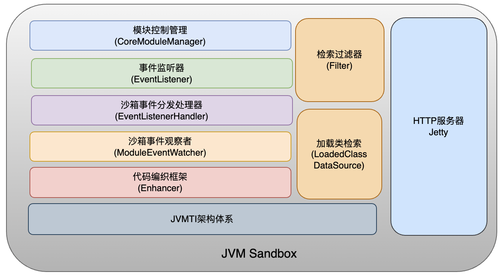

# JVM-SANDBOX-DEVELOPER
> 分析jvm-sandbox项目的包结构，为源码阅读、学习做准备。
> 
> 参考：https://blog.csdn.net/weixin_36996888/article/details/109098779
>
> 参考：https://xie.infoq.cn/article/c5be9834709f7eb48cfa683b1 源码解析
>
> 

## 按功能进行包分类

### 1、HTTP服务器(Jetty)

### 2、agent沙箱启动代理

### 3、core沙箱内核

### 4、spy间谍类

